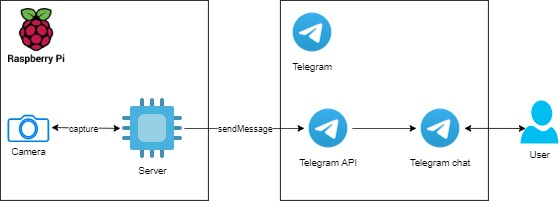

# Camera image motion detector
Raspberry Pi and camera module based motion detector.

The program constantly captures images on certain intervals. Upon detecting motion between the images, a notification gets sent through Telegram API to a certain user to notify about the detection.

## Diagram of the application

